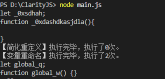
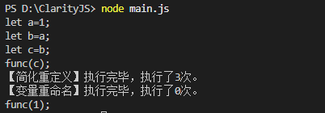
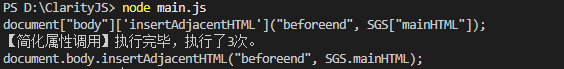
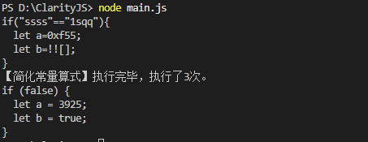

# ClarityJS
JavaScript Deconfusion Tool.
JavaScript解混淆工具，提供多种解混淆配置，支持自定义模块。
【施工中】

## 运行

本工具需要node环境以运行。先安装依赖，使用npm i安装。

修改main.js：

- line8的数组__main__以调整要加载的模块（如果不确定要用哪些模块，使用**节2 支持解密配置**中的配置即可）
- line17的输入文件位置
- line32的输出文件位置

然后node main.js以运行。

## 1 支持模块

### 1.1 cj.rename

重命名混淆变量，初始配置为简化_0x开头的变量。

**这个开头可以通过cj.rename.startwith(str)修改。**

注意：这个模块需要在解混淆尽可能的后期调用。由于混淆程序一般会创建非常多个变量->在前期调用这个函数很有可能会卡死。

### 1.2 cj.redefined

简化重定义。

### 1.3 cj.propertyclear

简化字典型调用如a["b"]["c"]。

### 1.4 cj.constclear

简化永真、永假、十六进制、复杂化常量。

## 2 支持解密配置

【施工中】

## 3 支持解密算法（？）

### jsjiami.com.v7

详情请看：https://forum.butian.net/share/4544