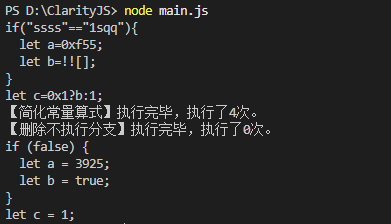

# ClarityJS
JavaScript Deconfusion Tool.

JavaScript解混淆工具，提供多种解混淆配置，支持自定义模块。

需要注意的是，本工具用了很多次eval（带有unsafe的模块）。请确认代码本身的情况或在断网的虚拟机中运行，避免执行到奇怪的地方。

【施工中】

## 运行

本工具需要node环境以运行。先安装依赖，使用npm i安装。

修改main.js：

- line8的数组__main__以调整要加载的模块（如果不确定要用哪些模块，使用**节2 支持解密配置**中的配置即可）
- line17的输入文件位置
- line32的输出文件位置

然后node main.js以运行。

## 1 支持模块

### 1.1 cj.rename <<<<

重命名混淆变量，初始配置为简化_0x开头的变量。

**这个开头可以通过cj.rename.startwith(str)修改。**

!! 注意：这个模块需要在解混淆尽可能的后期调用。由于混淆程序一般会创建非常多个变量->在前期调用这个函数很有可能会卡死。

### 1.2 cj.redefined >>>>

简化重定义，最好在一开始就调用。

### 1.3 cj.propertyclear

简化字典型调用如a["b"]["c"]。

### 1.4 【unsafe】 cj.constclear

简化永真、永假、十六进制、复杂化常量。

### 1.5 【unsafe】 cj.trimly <<< cj.constclear

删除永远不会执行的部分，如if的不执行分支和三目运算符的不执行分支。

!! 强烈建议在cj.constclear之后调用。

### 1.6 cj.auto_reconstuct

尝试还原执行流。主模块。

如果还原存在问题，可以手动设置。
【施工中】

### 1.7 cj.manual_refunction

将特定的函数调用形参还原以便阅读。

## 2 支持解密配置

【施工中】
### 2.1 jsjiami.com.v7

详情请看：https://forum.butian.net/share/4544

### 2.2 JSFuck

https://jsfuck.com/

main=[cj.constclear,cj.propertyclear] 直接调用。